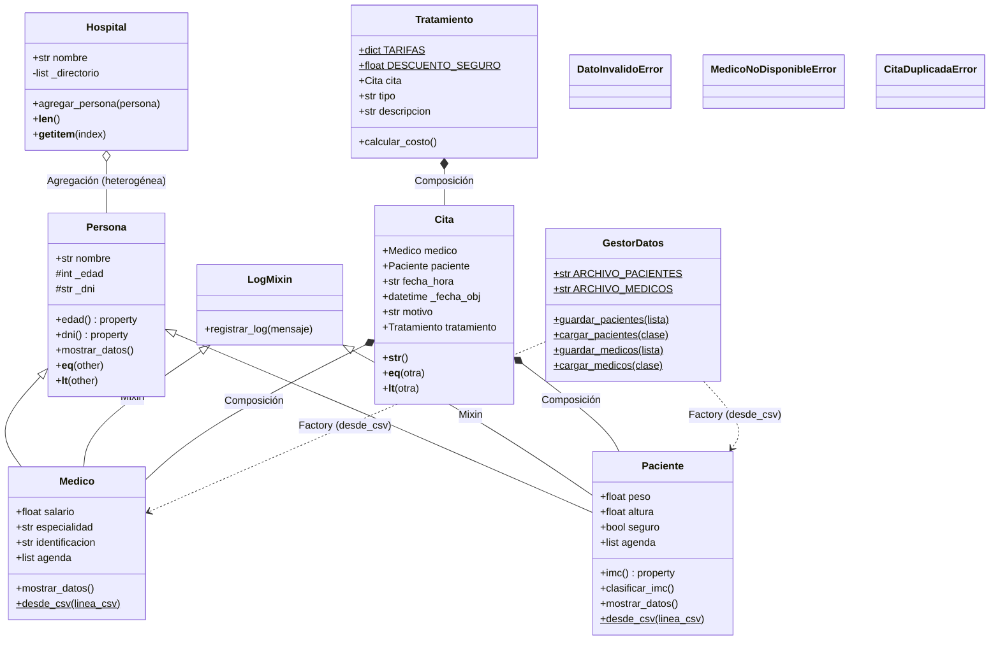

# 🏥 Sistema de Gestión Hospitalaria — Hospital UEV

Este proyecto es una simulación de un sistema de gestión hospitalaria desarrollado en **Python**, aplicando los pilares fundamentales de la **Programación Orientada a Objetos (POO)**. El sistema permite gestionar médicos, pacientes, citas y tratamientos con persistencia de datos en CSV y trazabilidad mediante logs.

---

## 🚀 Estructura del Proyecto

El sistema está diseñado de forma modular para facilitar la colaboración y el mantenimiento:

| Archivo | Responsabilidad |
|---|---|
| **`entidades.py`** | Modelos del dominio: `Persona` (base), `Paciente`, `Medico` y la excepción `DatoInvalidoError`. |
| **`logica.py`** | Lógica de negocio: `Cita`, `Tratamiento` y las excepciones `MedicoNoDisponibleError` y `CitaDuplicadaError`. |
| **`persistencia.py`** | Clase `GestorDatos` para lectura/escritura de objetos en archivos CSV. |
| **`hospital.py`** | Contenedor `Hospital` que mantiene una lista heterogénea de personas. |
| **`utilidades.py`** | Herramientas transversales como el `LogMixin` para auditoría automática. |
| **`main.py`** | Punto de entrada con el menú interactivo del usuario. |
| **`pacientes_db.csv`** · **`medicos_db.csv`** | Bases de datos persistentes (se generan automáticamente). |
| **`hospital_registro.log`** | Bitácora de eventos generada por `LogMixin`. |

---

## 👥 Roles y Responsabilidades

### 👤 Integrante 1 · Arquitecto de Entidades
* **Jerarquía de Herencia**: Diseño de `Persona` como clase base y derivación de `Paciente` y `Medico`.
* **Encapsulamiento**: Uso intensivo de `@property` con validaciones (peso, altura, edad, salario, especialidad, identificación).
* **Polimorfismo**: Sobrescritura del método `mostrar_datos()` en cada subclase.
* **Excepción personalizada**: Implementación de `DatoInvalidoError` para señalar violaciones de las reglas de dominio.
* **Métodos mágicos en `Persona`**: `__eq__` (igualdad por DNI) y `__lt__` (orden alfabético por nombre).

### 👤 Integrante 2 · Gestor de Operaciones
* **Composición**: `Cita` posee un `Medico` y un `Paciente`; `Tratamiento` posee una `Cita`.
* **Excepciones personalizadas**: `MedicoNoDisponibleError` (conflicto de agenda del médico) y `CitaDuplicadaError` (conflicto de agenda del paciente).
* **Validaciones de negocio**: Formato de fecha `DD/MM/AAAA HH:MM`, rechazo de fechas pasadas, validación del motivo (no vacío, máx. 100 caracteres) y verificación de tipos de objetos recibidos.
* **Sistema de tarifas**: Diccionario `TARIFAS` con cinco tipos de tratamiento y descuento automático del 40% para pacientes con seguro.
* **Métodos mágicos en `Cita` y `Tratamiento`**: `__str__`, `__repr__`, `__eq__`, `__lt__` (ordenamiento cronológico real, no alfabético).

### 👤 Integrante 3 · Especialista en Datos
* **Persistencia**: Clase `GestorDatos` con métodos estáticos para guardar y cargar pacientes y médicos en archivos CSV independientes.
* **Patrón Factory**: Métodos `@classmethod desde_csv()` en `Paciente` y `Medico` para reconstruir objetos desde líneas de texto, con el flag `es_nuevo=False` para evitar logs duplicados al cargar datos históricos.
* **Mixin de logging**: `LogMixin` con `registrar_log()`, heredado por `Paciente` y `Medico` (herencia múltiple) para auditoría automática de altas.
* **Gestión de archivos**: Uso de `with open(...)` y comprobación de existencia previa con `os.path.exists`.

### 👤 Integrante 4 · Integrador
* **Contenedor `Hospital`**: Clase con lista heterogénea `_directorio` y los métodos mágicos `__len__` y `__getitem__` para permitir `len(hospital)` y `for persona in hospital`.
* **Flujo principal**: Desarrollo del menú interactivo en `main.py` con cinco opciones (alta de paciente, alta de médico, mostrar directorio, programar cita y tratamiento, salir guardando).
* **Manejo de excepciones**: Captura escalonada de `ValueError`, `DatoInvalidoError`, `MedicoNoDisponibleError` y errores genéricos con mensajes claros al usuario.
* **Integración**: Orquestación del ciclo de vida (carga inicial → operaciones → guardado al salir) y filtrado de la lista heterogénea con `isinstance` para separar pacientes y médicos en la persistencia.

---

## 📊 Arquitectura del Sistema (UML)



### Excepciones del sistema

| Excepción | Definida en | Se lanza cuando... |
|---|---|---|
| `DatoInvalidoError` | `entidades.py` | Peso/altura ≤ 0, salario negativo, especialidad o ID vacíos. |
| `MedicoNoDisponibleError` | `logica.py` | Se intenta crear una cita en un horario ya ocupado por el médico. |
| `CitaDuplicadaError` | `logica.py` | El paciente ya tiene una cita registrada en ese mismo horario. |

---

## ⚙️ Instalación y Ejecución

El proyecto solo requiere **Python 3.10+** (no usa dependencias externas).

```bash
# Clonar el repositorio
git clone <url-del-repo>
cd hospital-uev

# Ejecutar el menú interactivo
python main.py
```

En el primer arranque, si no existen `pacientes_db.csv` ni `medicos_db.csv`, el sistema se inicia vacío y los creará al guardar.

### Opciones del menú

```
1. Agregar paciente
2. Agregar médico
3. Mostrar personas (demostración de Polimorfismo)
4. Programar Cita y Tratamiento
5. Salir y Guardar
```

---

## 🧪 Tests

Suite de tests con `unittest` que cubre las clases del dominio, el patrón Factory, los métodos mágicos y las excepciones personalizadas:

```bash
python -m unittest test_sistema -v
```

Los tests usan fechas dinámicas (`datetime.now() + timedelta`), por lo que **no caducan** con el paso del tiempo.

---

## 🎓 Conceptos POO Demostrados

| Concepto | Dónde se ve |
|---|---|
| **Herencia simple** | `Paciente(Persona)`, `Medico(Persona)` |
| **Herencia múltiple** | `Paciente(Persona, LogMixin)`, `Medico(Persona, LogMixin)` |
| **Encapsulamiento** | `@property` + `@setter` con validación en peso, altura, edad, salario, etc. |
| **Polimorfismo** | `mostrar_datos()` sobrescrito en cada subclase; iteración sobre lista heterogénea de `Persona` |
| **Composición** | `Cita` contiene `Medico` + `Paciente`; `Tratamiento` contiene `Cita` |
| **Agregación** | `Hospital` agrupa objetos `Persona` sin ser dueño exclusivo |
| **Mixin** | `LogMixin` añade capacidad de logging sin formar parte de la jerarquía principal |
| **Patrón Factory** | `Paciente.desde_csv()` y `Medico.desde_csv()` como constructores alternativos |
| **Métodos mágicos** | `__eq__`, `__lt__`, `__str__`, `__repr__`, `__len__`, `__getitem__` |
| **Excepciones personalizadas** | `DatoInvalidoError`, `MedicoNoDisponibleError`, `CitaDuplicadaError` |
| **Gestión de archivos** | `with open(...)` en `GestorDatos` y `LogMixin` |

---

## 📁 Formatos de archivo

**`pacientes_db.csv`**
```
nombre,edad,dni,peso,altura,seguro
María García López,34,12345678A,62,1.65,True
```

**`medicos_db.csv`**
```
nombre,edad,dni,salario,especialidad,identificacion
Ana Torres Vidal,45,11111111X,3500,Cardiología,COL-001
```

**`hospital_registro.log`**
```
[2026-05-12 14:23:01] Nuevo paciente creado: María García López (DNI: 12345678A)
[2026-05-12 14:23:05] Nuevo médico registrado: Dr./Dra. Ana Torres Vidal (Especialidad: Cardiología, ID: COL-001)
```
