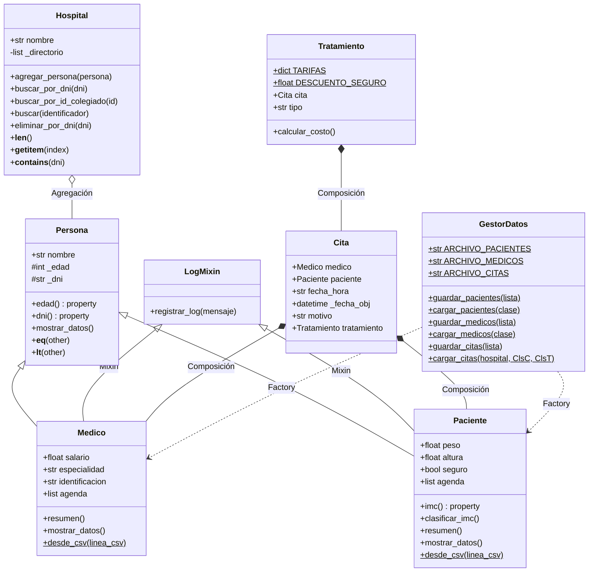

# 🏥 Sistema de Gestión Hospitalaria — Hospital UEV


Sistema interno de gestión hospitalaria desarrollado en **Python**, aplicando los pilares fundamentales de la **Programación Orientada a Objetos (POO)**. Diseñado para uso del personal sanitario y administrativo del **Hospital Universitario UEV** (Universidad Europea de Madrid).

Gestiona médicos, pacientes, citas y tratamientos con persistencia en CSV, trazabilidad mediante logs, generación de documentos profesionales imprimibles y dos interfaces de usuario (CLI y Web).

> 📌 **Versión actual: v2.6** — incluye sistema de impresión profesional (5 tipos de documentos), identidad visual UEV completa y 55 citas de prueba precargadas. Ver [`CHANGELOG.md`](CHANGELOG.md) para el historial completo.

---

## 📑 Tabla de Contenidos

- [✨ Características](#-características)
- [🖼️ Capturas](#️-capturas)
- [🚀 Estructura del Proyecto](#-estructura-del-proyecto)
- [⚙️ Instalación](#️-instalación)
- [🖥️ Uso](#️-uso)
- [🖨️ Sistema de impresión](#️-sistema-de-impresión)
- [❓ Solución de problemas comunes](#-solución-de-problemas-comunes)
- [👥 Roles y Responsabilidades](#-roles-y-responsabilidades)
- [📊 Arquitectura del Sistema (UML)](#-arquitectura-del-sistema-uml)
- [🧪 Tests](#-tests)
- [🎓 Conceptos POO Demostrados](#-conceptos-poo-demostrados)
- [📁 Formatos de archivo](#-formatos-de-archivo)

---

## ✨ Características

### Funcionalidad
- 🧬 **Jerarquía de clases** con herencia simple y múltiple (Mixin)
- 🔒 **Encapsulamiento** con validación automática vía `@property`
- 🎭 **Polimorfismo** sobre lista heterogénea de personas
- 🧩 **Composición** entre citas, médicos, pacientes y tratamientos
- 🏭 **Patrón Factory** para reconstrucción desde CSV
- ⚠️ **Excepciones personalizadas** para reglas de dominio
- 💾 **Persistencia completa** en CSV: pacientes, médicos y citas con tratamientos
- 🔍 **Búsqueda unificada** por DNI o ID Colegiado
- 📑 **Listados paginados** con navegación interactiva (CLI)
- 🗑️ **Eliminación de personas** con confirmación
- 📜 **Sistema de logs categorizado** (`[CREAR]`, `[ELIMINAR]`, `[BUSCAR]`, `[CITA]`, `[INFO]`, `[ERROR]`)

### Sistema de impresión (v2.6)
- 🖨️ **5 tipos de documentos profesionales** con identidad visual UEV
- 📄 **Documentos para paciente**: comprobante de cita, factura, informe clínico (IMC)
- 📊 **Documentos para personal interno**: agenda completa del médico, nómina trimestral
- 🔒 **Aislamiento de privacidad**: documentos del paciente ocultan el DNI del médico
- 🌈 **Impresión a color** con forzado `print-color-adjust: exact`
- 📥 **Descarga en PDF** opcional (xhtml2pdf)
- 🖥️ **Cross-platform** vía diálogo nativo del navegador (Windows / macOS / Linux)

### Interfaz e identidad visual
- 🎨 **Tema UEV oficial**: rojo corporativo (`#E63946`) y azul institucional (`#1B2444`)
- 🏛️ **Logo UEV** integrado en navegación y documentos imprimibles
- 🖥️ **Doble interfaz**: menú por consola (CLI) e interfaz web (Flask + Bootstrap 5)
- 📊 **Datos de prueba realistas**: 30 pacientes, 12 médicos, 55 citas precargadas
- 🧪 **Suite de 43 tests unitarios** con fechas dinámicas (no caducan)

---

## 🖼️ Capturas

> Para incluir capturas reales del sistema, guarda tus screenshots en una carpeta
> `docs/screenshots/` y descomenta las líneas de abajo. Sugerencias de capturas:

<!--

*Panel de control con estadísticas y próximas citas*


*Búsqueda unificada por DNI o ID Colegiado*


*Documento de factura imprimible con identidad UEV*


*Liquidación trimestral del médico (uso interno)*
-->

---

## 🚀 Estructura del Proyecto

```
poo-proyecto-final-hospital/
│
├── 📄 entidades.py         # Persona, Paciente, Medico, DatoInvalidoError
├── 📄 logica.py            # Cita, Tratamiento + excepciones de negocio
├── 📄 hospital.py          # Hospital + DniDuplicadoError, PersonaNoEncontradaError
├── 📄 persistencia.py      # GestorDatos (CSV de pacientes, médicos y citas)
├── 📄 utilidades.py        # LogMixin con sistema de niveles
├── 📄 main.py              # CLI: menú interactivo (8 opciones)
├── 📄 app.py               # Web: servidor Flask con 11 rutas
├── 📄 seed_data.py         # Generador de citas sintéticas
│
├── 📂 static/                       ← v2.6: identidad visual
│   ├── css/hospital.css             # Tema UEV (rojo/azul, tipografía Inter)
│   └── img/uev-logo.svg             # Logo institucional vectorial
│
├── 📂 templates/                    # Jinja2 + Bootstrap 5
│   ├── base.html                    # Layout principal
│   ├── index.html                   # Dashboard
│   ├── pacientes.html               # Gestión de pacientes
│   ├── medicos.html                 # Gestión de médicos
│   ├── citas.html                   # Agenda y programación
│   ├── buscar.html                  # Búsqueda unificada
│   ├── print_base.html              ← v2.6: plantilla base de impresión
│   ├── print_cita.html              ← v2.6: comprobante de cita
│   ├── print_factura.html           ← v2.6: factura de servicios
│   ├── print_informe.html           ← v2.6: informe clínico (IMC)
│   ├── print_agenda_medico.html     ← v2.6: agenda completa (interno)
│   └── print_nomina.html            ← v2.6: nómina trimestral (interno)
│
├── 📊 pacientes_db.csv     # 30 pacientes
├── 📊 medicos_db.csv       # 12 médicos
├── 📊 citas_db.csv         # 55 citas (generadas por seed_data.py)
├── 🧪 test_sistema.py      # 43 tests unitarios
├── 📋 requirements.txt     # Flask + xhtml2pdf
├── 📋 CHANGELOG.md         # Historial de cambios
├── 📋 LICENSE              # Licencia MIT
├── 📋 .gitignore           # Archivos ignorados por Git
└── 📖 README.md            # Este archivo
```

---

## ⚙️ Instalación

### Requisitos previos

- **Python 3.10 o superior** — [Descargar Python](https://www.python.org/downloads/)
- **Git** (opcional, solo si vas a clonar en lugar de descargar el ZIP) — [Descargar Git](https://git-scm.com/downloads)

> 💡 **Verifica tu versión de Python** antes de empezar:
> ```bash
> python --version      # Windows
> python3 --version     # macOS / Linux
> ```
> Si la versión es inferior a 3.10, descarga una más reciente del enlace de arriba.

### Obtener el código

**Opción A — Clonar con Git** (recomendado):
```bash
git clone https://github.com/yiaogit/poo-proyecto-final-hopital.git
cd poo-proyecto-final-hopital
```

**Opción B — Descargar ZIP**:
1. Ve a la página del repositorio
2. Pulsa el botón verde **Code → Download ZIP**
3. Descomprime el archivo y abre una terminal dentro de la carpeta resultante

### Instalación según tu sistema operativo

<details>
<summary><b>🪟 Windows (PowerShell)</b></summary>

```powershell
# 1. Crear entorno virtual
python -m venv venv

# 2. Activar el entorno
venv\Scripts\Activate.ps1

# Si PowerShell rechaza ejecutar scripts, ejecuta UNA VEZ:
# Set-ExecutionPolicy -Scope CurrentUser -ExecutionPolicy RemoteSigned

# 3. Instalar dependencias
pip install -r requirements.txt
```

Verás `(venv)` al inicio de tu prompt cuando el entorno esté activo.
</details>

<details>
<summary><b>🪟 Windows (CMD)</b></summary>

```cmd
python -m venv venv
venv\Scripts\activate.bat
pip install -r requirements.txt
```
</details>

<details>
<summary><b>🍎 macOS</b></summary>

```bash
# 1. Crear entorno virtual (usa python3 en macOS)
python3 -m venv venv

# 2. Activar el entorno
source venv/bin/activate

# 3. Instalar dependencias
pip install -r requirements.txt
```

> Si `python3` no está instalado, instálalo con [Homebrew](https://brew.sh):
> ```bash
> brew install python
> ```
</details>

<details>
<summary><b>🐧 Linux (Ubuntu / Debian)</b></summary>

```bash
# Si Python no está instalado:
sudo apt update && sudo apt install python3 python3-venv python3-pip -y

# 1. Crear entorno virtual
python3 -m venv venv

# 2. Activar el entorno
source venv/bin/activate

# 3. Instalar dependencias
pip install -r requirements.txt
```
</details>

---

## 🖥️ Uso

> ℹ️ En **macOS/Linux** sustituye `python` por `python3` en todos los comandos.
> En **Windows** usa `python` tal cual.

### Interfaz por consola (CLI)

```bash
python main.py
```

```
╔══ MENÚ: Hospital Universitario UEV ══╗
║ 1. Agregar paciente
║ 2. Agregar médico
║ 3. Mostrar personas (polimorfismo, paginado)
║ 4. Programar cita y tratamiento
║ 5. Buscar persona (por DNI o ID Colegiado)
║ 6. Eliminar persona por DNI
║ 7. Mostrar todas las citas
║ 8. Salir y guardar
╚════════════════════════════════════╝
```

### Interfaz web (Flask)

```bash
python app.py
```

Abre <http://127.0.0.1:5000> en el navegador. La interfaz web reutiliza **exactamente las mismas clases** del modelo de dominio — Flask actúa solo como capa de presentación.

Rutas disponibles:

| Ruta | Función |
|---|---|
| `/` | Dashboard con resumen y próximas citas |
| `/pacientes` | Listado y alta de pacientes |
| `/medicos` | Listado y alta de médicos |
| `/citas` | Agenda completa y programación de citas |
| `/buscar` | Búsqueda por DNI |
| `/eliminar/<dni>` | Eliminar persona (POST) |

Para detener el servidor, pulsa `Ctrl + C` en la terminal.

### Salir del entorno virtual

Cuando termines de trabajar:

```bash
deactivate
```

---

## 🖨️ Sistema de impresión

A partir de la versión 2.6 el sistema genera **cinco tipos de documentos profesionales** con la identidad visual del Hospital UEV. La impresión funciona en Windows, macOS y Linux a través del diálogo nativo del navegador, sin necesidad de instalar drivers específicos.

### Documentos disponibles

| Documento | Destinatario | Contenido | Privacidad |
|---|---|---|---|
| **Comprobante de cita** | Paciente | Fecha, especialidad, motivo | Sin DNI del médico |
| **Factura** | Paciente | Tarifa, descuento por seguro, total | Sin DNI del médico |
| **Informe clínico (IMC)** | Paciente | Antropometría, clasificación OMS, recomendaciones | Sin DNI del médico |
| **Agenda del médico** | Personal interno | Todas las citas con DNI de pacientes | Documento interno |
| **Nómina trimestral** | Personal interno | Ingresos últimos 3 meses por mes y detalle | Documento interno |

### Cómo imprimir

1. Localiza al paciente o médico (vía listado o búsqueda)
2. Pulsa el icono 🖨 en su fila → elige el documento
3. En la página del documento, pulsa **"🖨️ Imprimir"** → se abre el diálogo del sistema

### Imprimir en color

Los navegadores **desactivan los fondos y colores por defecto** para ahorrar tinta. Para que los documentos se impriman con la identidad visual UEV completa, en el diálogo de impresión asegúrate de marcar:

- **Chrome / Edge**: `Más ajustes` → ✅ **Gráficos de fondo**
- **Firefox**: `Configuración de página` → ✅ **Imprimir fondos**
- **Safari**: ✅ **Print backgrounds**

El sistema usa `print-color-adjust: exact` para minimizar este problema, pero los navegadores pueden seguir respetando la preferencia del usuario.

### Descargar como PDF

Cada documento tiene también un botón **"📥 Descargar PDF"** que utiliza la librería `xhtml2pdf` para generar un archivo descargable. Útil para archivar en sistemas internos o enviar por correo.

### Aislamiento de datos personales

Los documentos para paciente **nunca muestran el DNI del médico**: solo el número de colegiado (`COL-XXX`), que es la identificación profesional pública. Los documentos internos (agenda, nómina) sí muestran toda la información, ya que están restringidos al personal autorizado por las normativas LOPDGDD 3/2018 y RGPD UE 2016/679.

---

## ❓ Solución de problemas comunes

<details>
<summary><b>"python no se reconoce como comando" (Windows)</b></summary>

Python no está en el `PATH`. Reinstala desde [python.org](https://www.python.org/downloads/) marcando la casilla **"Add Python to PATH"** durante la instalación.
</details>

<details>
<summary><b>"command not found: python" (macOS)</b></summary>

En macOS el comando es `python3`, no `python`. Si tampoco existe, instala vía Homebrew: `brew install python`.
</details>

<details>
<summary><b>"jinja2.exceptions.TemplateNotFound: index.html"</b></summary>

La carpeta `templates/` debe estar **al mismo nivel** que `app.py`. Comprueba que existe y contiene los 5 archivos HTML.
</details>

<details>
<summary><b>"No se pueden programar citas en el pasado" al ejecutar tests</b></summary>

Esto solo pasaría si usaras versiones antiguas de los tests con fechas fijas. El `test_sistema.py` de este repositorio usa fechas dinámicas y nunca caduca.
</details>

<details>
<summary><b>PowerShell: "no se puede cargar el archivo Activate.ps1"</b></summary>

Ejecuta una sola vez con permisos de administrador:
```powershell
Set-ExecutionPolicy -Scope CurrentUser -ExecutionPolicy RemoteSigned
```
</details>

<details>
<summary><b>El documento impreso sale en blanco y negro</b></summary>

Los navegadores omiten los fondos y colores por defecto para ahorrar tinta. En el diálogo de impresión, activa **"Gráficos de fondo"** (Chrome/Edge), **"Imprimir fondos"** (Firefox) o **"Print backgrounds"** (Safari).
</details>

<details>
<summary><b>El botón "Descargar PDF" muestra un aviso y devuelve HTML</b></summary>

La librería `xhtml2pdf` no está instalada. Ejecuta:
```bash
pip install xhtml2pdf
```
Mientras tanto, el botón "🖨️ Imprimir" sigue funcionando — desde el diálogo puedes elegir **"Guardar como PDF"** en cualquier sistema operativo.
</details>

<details>
<summary><b>"No hay citas registradas" tras descargar el repo</b></summary>

El archivo `citas_db.csv` viene precargado con 55 citas. Si lo borraste o quieres regenerarlas, ejecuta:
```bash
python seed_data.py
```
</details>

---

## 👥 Roles y Responsabilidades

### 👤 Integrante 1 · Arquitecto de Entidades
- **Jerarquía de Herencia**: Diseño de `Persona` como clase base y derivación de `Paciente` y `Medico`.
- **Encapsulamiento**: Uso intensivo de `@property` con validaciones (peso, altura, edad, salario, especialidad, identificación).
- **Polimorfismo**: Sobrescritura del método `mostrar_datos()` en cada subclase.
- **Excepción personalizada**: Implementación de `DatoInvalidoError`.
- **Métodos mágicos en `Persona`**: `__eq__` (igualdad por DNI) y `__lt__` (orden alfabético).

### 👤 Integrante 2 · Gestor de Operaciones
- **Composición**: `Cita` posee un `Medico` y un `Paciente`; `Tratamiento` posee una `Cita`.
- **Excepciones personalizadas**: `MedicoNoDisponibleError` y `CitaDuplicadaError`.
- **Validaciones de negocio**: Formato de fecha `DD/MM/AAAA HH:MM`, rechazo de fechas pasadas, validación del motivo y verificación de tipos.
- **Sistema de tarifas**: `TARIFAS` con cinco tipos de tratamiento y descuento automático del 40% para pacientes con seguro.
- **Métodos mágicos en `Cita` y `Tratamiento`**: `__str__`, `__repr__`, `__eq__`, `__lt__` (orden cronológico real).

### 👤 Integrante 3 · Especialista en Datos
- **Persistencia**: Clase `GestorDatos` con métodos estáticos para guardar y cargar pacientes y médicos en CSV independientes.
- **Patrón Factory**: `@classmethod desde_csv()` en `Paciente` y `Medico` con flag `es_nuevo=False` para evitar logs duplicados.
- **Mixin de logging**: `LogMixin` con `registrar_log()`, heredado por `Paciente` y `Medico`.
- **Gestión de archivos**: Uso de `with open(...)` y comprobación de existencia con `os.path.exists`.

### 👤 Integrante 4 · Integrador
- **Contenedor `Hospital`**: Lista heterogénea `_directorio` con `__len__` y `__getitem__`.
- **Flujo principal**: Menú interactivo en `main.py` con cinco opciones.
- **Manejo de excepciones**: Captura escalonada de `ValueError`, `DatoInvalidoError`, `MedicoNoDisponibleError`.
- **Integración**: Orquestación del ciclo carga → operaciones → guardado.

---

## 📊 Arquitectura del Sistema (UML)



### Excepciones del sistema

| Excepción | Definida en | Se lanza cuando... |
|---|---|---|
| `DatoInvalidoError` | `entidades.py` | Peso/altura ≤ 0, salario negativo, especialidad/ID/DNI vacíos. |
| `MedicoNoDisponibleError` | `logica.py` | El médico ya tiene una cita en ese horario. |
| `CitaDuplicadaError` | `logica.py` | El paciente ya tiene una cita en ese horario. |
| `DniDuplicadoError` | `hospital.py` | Se intenta registrar a alguien con un DNI ya existente. |
| `PersonaNoEncontradaError` | `hospital.py` | Se intenta eliminar o buscar a alguien que no existe. |

---

## 🧪 Tests

Suite con `unittest` que cubre clases del dominio, patrón Factory, métodos mágicos, excepciones personalizadas, CRUD del Hospital y persistencia de citas:

```bash
python -m unittest test_sistema -v
```

```
Ran 43 tests in 0.012s
OK
```

Distribución de los tests:

| Grupo | Tests | Cubre |
|---|---|---|
| `TestPersona` | 7 | herencia, encapsulamiento, `__eq__`, `__lt__` |
| `TestPaciente` | 8 | IMC, validaciones, Factory `desde_csv` |
| `TestMedico` | 6 | especialidad, salario, agenda inicial |
| `TestPolimorfismo` | 3 | lista heterogénea, `mostrar_datos()` dispatch |
| `TestCita` | 6 | composición, formato de fecha, orden cronológico |
| `TestTratamiento` | 4 | tarifas, descuento por seguro |
| `TestHospitalCRUD` | 7 | unicidad de DNI, búsqueda, eliminación |
| `TestPersistenciaCitas` | 2 | guardar/cargar citas con tratamiento |

Los tests usan fechas dinámicas (`datetime.now() + timedelta`), por lo que **no caducan** con el paso del tiempo.

---

## 🎓 Conceptos POO Demostrados

| Concepto | Dónde se ve |
|---|---|
| **Herencia simple** | `Paciente(Persona)`, `Medico(Persona)` |
| **Herencia múltiple** | `Paciente(Persona, LogMixin)`, `Medico(Persona, LogMixin)` |
| **Encapsulamiento** | `@property` + `@setter` con validación en cada atributo crítico |
| **Polimorfismo** | `mostrar_datos()` sobrescrito; iteración sobre lista heterogénea de `Persona` |
| **Composición** | `Cita` ⟶ `Medico` + `Paciente`; `Tratamiento` ⟶ `Cita` |
| **Agregación** | `Hospital` agrupa objetos `Persona` |
| **Mixin** | `LogMixin` añade logging sin ser parte de la jerarquía principal |
| **Patrón Factory** | `Paciente.desde_csv()` y `Medico.desde_csv()` |
| **Métodos mágicos** | `__eq__`, `__lt__`, `__str__`, `__repr__`, `__len__`, `__getitem__` |
| **Excepciones personalizadas** | `DatoInvalidoError`, `MedicoNoDisponibleError`, `CitaDuplicadaError` |
| **Gestión de archivos** | `with open(...)` en `GestorDatos` y `LogMixin` |

---

## 📁 Formatos de archivo

**`pacientes_db.csv`** — `nombre,edad,dni,peso,altura,seguro`
```
María García López,34,12345678A,62,1.65,True
Carlos Martínez Ruiz,58,23456789B,88,1.78,True
```

**`medicos_db.csv`** — `nombre,edad,dni,salario,especialidad,identificacion`
```
Ana Torres Vidal,45,11111111X,3500,Cardiología,COL-001
Roberto Sánchez Pérez,52,22222222Y,4200,Pediatría,COL-002
```

**`citas_db.csv`** — `dni_paciente,id_medico,fecha_hora,motivo,tipo_tratamiento,descripcion`
```
23456789B,COL-001,20/06/2027 10:00,Revisión anual,consulta,Electrocardiograma
34567890C,COL-002,22/06/2027 11:30,Control pediátrico,,
```
*Los dos últimos campos quedan vacíos si la cita no tiene tratamiento asociado.*

**`hospital_registro.log`** — formato `[YYYY-MM-DD HH:MM:SS] [NIVEL] mensaje`
```
[2026-05-12 14:23:01] [CREAR] Alta en directorio del hospital: Paciente María García López (DNI: 12345678A).
[2026-05-12 14:23:05] [CREAR] Alta en directorio del hospital: Medico Ana Torres Vidal (DNI: 11111111X).
[2026-05-12 14:25:12] [BUSCAR] Búsqueda exitosa: DNI 12345678A corresponde a María García López.
[2026-05-12 14:25:30] [CITA] Cita programada: María García López con Ana Torres Vidal el 20/06/2027 10:00 — motivo: Revisión anual
[2026-05-12 14:25:30] [CITA] Tratamiento 'consulta' asociado a la cita de María García López (20/06/2027 10:00) — coste: 30.00€
[2026-05-12 14:26:15] [ELIMINAR] Baja del directorio: Paciente Test (DNI: 99999999X).
[2026-05-12 14:26:40] [ERROR] Intento de alta duplicada: ya existe alguien con DNI 12345678A.
```

Niveles disponibles: `[INFO]` `[CREAR]` `[ELIMINAR]` `[BUSCAR]` `[CITA]` `[ERROR]`.
Filtrar eventos concretos es trivial: `grep "\[ERROR\]" hospital_registro.log`.

---

## 📝 Licencia

Este proyecto se distribuye bajo licencia MIT — uso libre con atribución.

## 👨‍💻 Autores

Equipo de 4 integrantes — Proyecto Final de Programación Orientada a Objetos.
