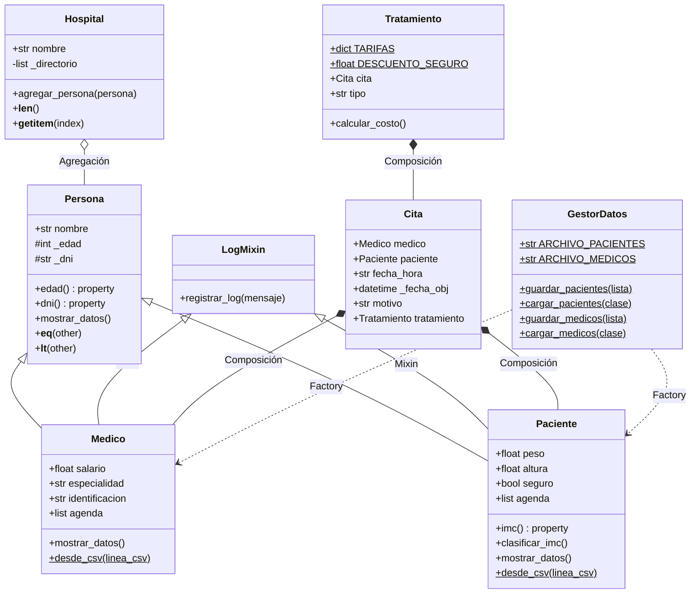

# 🏥 Sistema de Gestión Hospitalaria — Hospital UEV


Simulación de un sistema de gestión hospitalaria desarrollado en **Python**, aplicando los pilares fundamentales de la **Programación Orientada a Objetos (POO)**. Permite gestionar médicos, pacientes, citas y tratamientos con persistencia en CSV, trazabilidad mediante logs y dos interfaces de usuario (CLI y Web).

---

## 📑 Tabla de Contenidos

- [✨ Características](#-características)
- [🚀 Estructura del Proyecto](#-estructura-del-proyecto)
- [⚙️ Instalación](#️-instalación)
- [🖥️ Uso](#️-uso)
- [👥 Roles y Responsabilidades](#-roles-y-responsabilidades)
- [📊 Arquitectura del Sistema (UML)](#-arquitectura-del-sistema-uml)
- [🧪 Tests](#-tests)
- [🎓 Conceptos POO Demostrados](#-conceptos-poo-demostrados)
- [📁 Formatos de archivo](#-formatos-de-archivo)

---

## ✨ Características

- 🧬 **Jerarquía de clases** con herencia simple y múltiple (Mixin)
- 🔒 **Encapsulamiento** con validación automática vía `@property`
- 🎭 **Polimorfismo** sobre lista heterogénea de personas
- 🧩 **Composición** entre citas, médicos, pacientes y tratamientos
- 🏭 **Patrón Factory** para reconstrucción desde CSV
- ⚠️ **Excepciones personalizadas** para reglas de dominio
- 💾 **Persistencia automática** en archivos CSV
- 📜 **Sistema de logs** con timestamps mediante Mixin
- 🖥️ **Doble interfaz**: menú por consola (CLI) e interfaz web (Flask + Bootstrap)
- 🧪 **Suite de 34 tests unitarios** con fechas dinámicas (no caducan)

---

## 🚀 Estructura del Proyecto

```
poo-proyecto-final-hospital/
│
├── 📄 entidades.py         # Persona, Paciente, Medico, DatoInvalidoError
├── 📄 logica.py            # Cita, Tratamiento + excepciones de negocio
├── 📄 persistencia.py      # GestorDatos (lectura/escritura CSV)
├── 📄 hospital.py          # Hospital (contenedor heterogéneo)
├── 📄 utilidades.py        # LogMixin (auditoría automática)
├── 📄 main.py              # CLI: menú interactivo
├── 📄 app.py               # Web: servidor Flask
│
├── 📂 templates/           # Plantillas HTML (Jinja2 + Bootstrap 5)
│   ├── base.html
│   ├── index.html
│   ├── pacientes.html
│   ├── medicos.html
│   └── citas.html
│
├── 📊 pacientes_db.csv     # Base de datos de pacientes
├── 📊 medicos_db.csv       # Base de datos de médicos
├── 🧪 test_sistema.py      # 34 tests unitarios
├── 📋 requirements.txt     # Dependencias
└── 📖 README.md            # Este archivo
```

---

## ⚙️ Instalación

**Requisitos**: Python 3.10 o superior.

```bash
# 1. Clonar el repositorio
git clone https://github.com/yiaogit/poo-proyecto-final-hospital.git
cd poo-proyecto-final-hospital

# 2. Crear entorno virtual
python -m venv venv

# 3. Activar el entorno
# Windows (PowerShell)
venv\Scripts\Activate.ps1
# Windows (CMD)
venv\Scripts\activate.bat
# macOS / Linux
source venv/bin/activate

# 4. Instalar dependencias
pip install -r requirements.txt
```

---

## 🖥️ Uso

### Interfaz por consola (CLI)

```bash
python main.py
```

```
--- MENÚ: Hospital Universitario UEV ---
1. Agregar paciente
2. Agregar médico
3. Mostrar personas (Polimorfismo)
4. Programar Cita y Tratamiento
5. Salir y Guardar
```

### Interfaz web (Flask)

```bash
python app.py
```

Abre <http://127.0.0.1:5000> en el navegador. La interfaz web reutiliza **exactamente las mismas clases** del modelo de dominio — Flask actúa solo como capa de presentación.

---

## 👥 Roles y Responsabilidades

### 👤 Integrante 1 · Arquitecto de Entidades
- **Jerarquía de Herencia**: Diseño de `Persona` como clase base y derivación de `Paciente` y `Medico`.
- **Encapsulamiento**: Uso intensivo de `@property` con validaciones (peso, altura, edad, salario, especialidad, identificación).
- **Polimorfismo**: Sobrescritura del método `mostrar_datos()` en cada subclase.
- **Excepción personalizada**: Implementación de `DatoInvalidoError`.
- **Métodos mágicos en `Persona`**: `__eq__` (igualdad por DNI) y `__lt__` (orden alfabético).

### 👤 Integrante 2 · Gestor de Operaciones
- **Composición**: `Cita` posee un `Medico` y un `Paciente`; `Tratamiento` posee una `Cita`.
- **Excepciones personalizadas**: `MedicoNoDisponibleError` y `CitaDuplicadaError`.
- **Validaciones de negocio**: Formato de fecha `DD/MM/AAAA HH:MM`, rechazo de fechas pasadas, validación del motivo y verificación de tipos.
- **Sistema de tarifas**: `TARIFAS` con cinco tipos de tratamiento y descuento automático del 40% para pacientes con seguro.
- **Métodos mágicos en `Cita` y `Tratamiento`**: `__str__`, `__repr__`, `__eq__`, `__lt__` (orden cronológico real).

### 👤 Integrante 3 · Especialista en Datos
- **Persistencia**: Clase `GestorDatos` con métodos estáticos para guardar y cargar pacientes y médicos en CSV independientes.
- **Patrón Factory**: `@classmethod desde_csv()` en `Paciente` y `Medico` con flag `es_nuevo=False` para evitar logs duplicados.
- **Mixin de logging**: `LogMixin` con `registrar_log()`, heredado por `Paciente` y `Medico`.
- **Gestión de archivos**: Uso de `with open(...)` y comprobación de existencia con `os.path.exists`.

### 👤 Integrante 4 · Integrador
- **Contenedor `Hospital`**: Lista heterogénea `_directorio` con `__len__` y `__getitem__`.
- **Flujo principal**: Menú interactivo en `main.py` con cinco opciones.
- **Manejo de excepciones**: Captura escalonada de `ValueError`, `DatoInvalidoError`, `MedicoNoDisponibleError`.
- **Integración**: Orquestación del ciclo carga → operaciones → guardado.

---

## 📊 Arquitectura del Sistema (UML)



### Excepciones del sistema

| Excepción | Definida en | Se lanza cuando... |
|---|---|---|
| `DatoInvalidoError` | `entidades.py` | Peso/altura ≤ 0, salario negativo, especialidad o ID vacíos. |
| `MedicoNoDisponibleError` | `logica.py` | El médico ya tiene una cita en ese horario. |
| `CitaDuplicadaError` | `logica.py` | El paciente ya tiene una cita en ese horario. |

---

## 🧪 Tests

Suite con `unittest` que cubre clases del dominio, patrón Factory, métodos mágicos y excepciones personalizadas:

```bash
python -m unittest test_sistema -v
```

```
Ran 34 tests in 0.012s
OK
```

Los tests usan fechas dinámicas (`datetime.now() + timedelta`), por lo que **no caducan** con el paso del tiempo.

---

## 🎓 Conceptos POO Demostrados

| Concepto | Dónde se ve |
|---|---|
| **Herencia simple** | `Paciente(Persona)`, `Medico(Persona)` |
| **Herencia múltiple** | `Paciente(Persona, LogMixin)`, `Medico(Persona, LogMixin)` |
| **Encapsulamiento** | `@property` + `@setter` con validación en cada atributo crítico |
| **Polimorfismo** | `mostrar_datos()` sobrescrito; iteración sobre lista heterogénea de `Persona` |
| **Composición** | `Cita` ⟶ `Medico` + `Paciente`; `Tratamiento` ⟶ `Cita` |
| **Agregación** | `Hospital` agrupa objetos `Persona` |
| **Mixin** | `LogMixin` añade logging sin ser parte de la jerarquía principal |
| **Patrón Factory** | `Paciente.desde_csv()` y `Medico.desde_csv()` |
| **Métodos mágicos** | `__eq__`, `__lt__`, `__str__`, `__repr__`, `__len__`, `__getitem__` |
| **Excepciones personalizadas** | `DatoInvalidoError`, `MedicoNoDisponibleError`, `CitaDuplicadaError` |
| **Gestión de archivos** | `with open(...)` en `GestorDatos` y `LogMixin` |

---

## 📁 Formatos de archivo

**`pacientes_db.csv`** — `nombre,edad,dni,peso,altura,seguro`
```
María García López,34,12345678A,62,1.65,True
Carlos Martínez Ruiz,58,23456789B,88,1.78,True
```

**`medicos_db.csv`** — `nombre,edad,dni,salario,especialidad,identificacion`
```
Ana Torres Vidal,45,11111111X,3500,Cardiología,COL-001
Roberto Sánchez Pérez,52,22222222Y,4200,Pediatría,COL-002
```

**`hospital_registro.log`**
```
[2026-05-12 14:23:01] Nuevo paciente creado: María García López (DNI: 12345678A)
[2026-05-12 14:23:05] Nuevo médico registrado: Dr./Dra. Ana Torres Vidal (Especialidad: Cardiología, ID: COL-001)
```

---

## 📝 Licencia

Este proyecto se distribuye bajo licencia MIT — uso libre con atribución.

## 👨‍💻 Autores

Equipo de 4 integrantes — Proyecto Final de Programación Orientada a Objetos.
